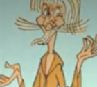
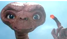

# Het ETmbit-project
Het ETmbit-project biedt een **complete leerlijn robotica** en maakt het lesgeven erin eenvoudig en toegankelijk. Het project is gericht op:
- bovenbouw basisonderwijs 
- onderbouw voortgezet onderwijs

ETmbit met **micro:bit + MakeCode**. Robotonderdelen worden **kant-en-klaar** aangeschaft of **3D-geprint**. Bij iedere les zit een **bouwgids** (inclusief bestellijsten en bestanden voor de 3D-printer), een **docentenhandleiding** en uiteraard het **lesmateriaal**. Van leerkrachten en docenten wordt **minimale voorkennis en voorbereiding** verwacht. 

 

## :twisted_rightwards_arrows: Lesplan
ETmbit heeft **gedifferentieerd leren** als uitgangspunt. Leerlingen kiezen hun eigen route door het lesmateriaal op basis van interesse, niveau en leerstijl. Leerkrachten en docenten gebruiken een **volgsysteem** om hun ontwikkeling te begeleiden. Geen ingewikkelde sheets — alles werkt met één enkele, voor zowel de leerlingen als de lesgevende **overzichtlijke routekaart**.

:large_orange_diamond: [routekaart](.method/NL/et-nl-routekaart.pdf)

 

## :basket: Lesinhoud
Hier is **spelenderwijs leren** de boodschap. Het begint met enkele bekende spelletjes om te leren hoe MakeCode werkt — *kat-en-muis*, *snake*, *simon-says*. Het lesmateriaal biedt veel **challenges**. Via verschillende routes door het ETmbit-materiaal ontwikkelen leerlingen uiteindelijk dezelfde vaardigheden. Voor elk wat wils:

:soccer: sport, :musical_note: muziek, :cartwheeling: dans, :video_game: games, :seedling: natuur, :baby: verzorging, :nut_and_bolt: techniek, :clapper: beeld, enz.

:large_orange_diamond: [naar de lessen](.method/NL/lessen/)

  

## :movie_camera: En ...
Waarom *ElecTricks*? De naam komt van twee film-figuren uit mijn jeugd:
  

**Catweazel**. De in het heden belande middeleeuwse magiër, die de wonderlijke mogelijkheden van elektriciteit *electrickity* noemde.
  

**ET, the extraterrestrial**. Het eenzaam op aarde achtergelaten buitenaards wezentje, met het aandoenlijke verzoek: *ET phone home*.
